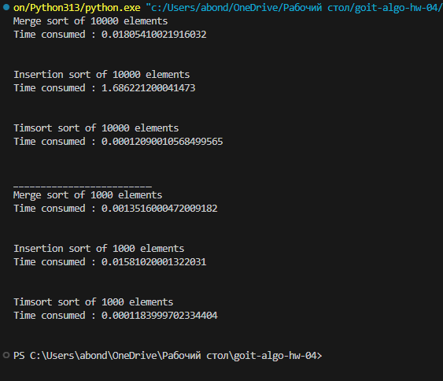
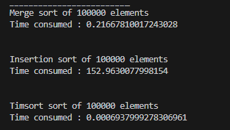

Для проведення даного експерименту було використано два набори даних, а саме два масиви arr та arr2. Перший масив містить у собі 10000 елементів, згенерованих навмання, а другий - 1000 елементів згенерованих навмання. Вся генерація відбувається через функцію random().
Згідно із результатами першого експеримента, який бачимо на скриншоті нижче:

Ми можемо зробити висновок, що сортування вставками виконується найдовше, а саме 1.68 секунд для 10000 елементів та 0.015 для 1000 елементів. На другому місці стоїть алгоритм злиття, який займає 0.018 секунд для 10000 елементів та 0.0013 секунд для 1000 елементів.
Найшвидшим та найбільш оптимізованим є вбудований у python алгоритм сортування через timsort. Для 10000 елементів сортування через нього займає 0.000118 секунд а для 1000 елементів - 0.000118

Для наочності провели ще один ексеримент але для масиву що складає 100000 елементів. Результати наступні:

Сортування вставками зайняло більше ніж 2 хвилини, що є надзвичайно довгим поазником. Найкраще із завданням впорався timsort, відсортувавши цей масив за 0.00069 секунди
